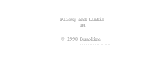

# Currency Converter

A Currency Converter Web as a way to study Angular.

## Example

## Features

- [x] Create project calculator
- [x] Create README
- [ ] Install dependencies
    - [x] bootstrap
    - [x] jquery
- [x] Configuring bootstrap in ***'angular.json'***
- [x] Create converter module
- [x] Create conversion model
- [x] Create currency model
- [x] Create response conversion model
- [x] Create converter component
- [x] Create currency management service
- [x] Implement currency management service
- [x] Create converter service
- [x] Implement converter service
- [x] Implement conversion form
- [x] Create validation number directive
- [x] Implement validation number directive
- [x] Implement currency conversion action
- [x] Create modal quotation component
- [x] Implement modal quotation component html
- [ ] Create date-br filter pipe
    

## Angular version

This project was generated with [Angular CLI](https://github.com/angular/angular-cli) version 12.2.8.

## Development server

Run `ng serve` for a dev server. Navigate to `http://localhost:4200/`. The app will automatically reload if you change any of the source files.

## Code scaffolding

Run `ng generate component component-name` to generate a new component. You can also use `ng generate directive|pipe|service|class|guard|interface|enum|module`.

## Build

Run `ng build` to build the project. The build artifacts will be stored in the `dist/` directory.

## Running unit tests

Run `ng test` to execute the unit tests via [Karma](https://karma-runner.github.io).

## Running end-to-end tests

Run `ng e2e` to execute the end-to-end tests via a platform of your choice. To use this command, you need to first add a package that implements end-to-end testing capabilities.

## Further help

To get more help on the Angular CLI use `ng help` or go check out the [Angular CLI Overview and Command Reference](https://angular.io/cli) page.

### About

This project is the minimum expected result of training [Udemy](https://www.udemy.com/course/formacao-angular-inicio-criando-7-projetos/).
